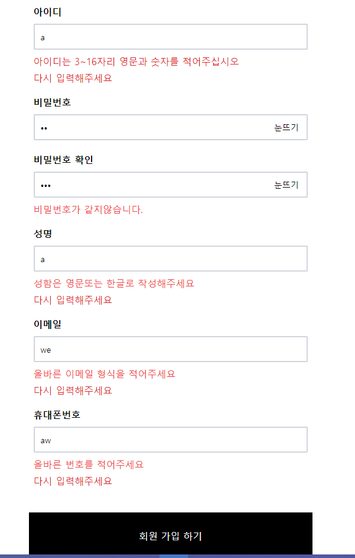

# 프론트

<aside>
✋ 현 관리자 : 이승제 , 김병민

</aside>

### ⚙️ eslint

<aside>
 기본적 prettier 연동과 import오류 설정만 되어있습니다.

</aside>

```jsx
module.exports = {
  root: true,
  env: {
    browser: true,
    es6: true,
  },
  extends: [
    "plugin:import/errors",
    "plugin:import/warnings",
    "plugin:prettier/recommended",
  ],
  parserOptions: {
    sourceType: "module",
    ecmaVersion: 2020,
    allowImportExportEverywhere: true,
    ecmaFeatures: {
      jsx: true,
      modules: true,
      experimentalObjectRestSpread: true,
    },
  },
  rules: {
    "prettier/prettier": [
      "error",
      {
        endOfLine: "auto",
      },
    ],
  },
  settings: {
    "import/resolver": {
      node: {
        extensions: [".js", ".jsx", ".ts", ".tsx"],
      },
    },
  },
};
```

### ⚙️ prettier

<aside>
*️⃣ 기본 prettier 설정입니다.

</aside>

```jsx
module.exports = {
  endOfLine: "lf",
  tabWidth: 2,
  semi: true,
  singleQuote: true,
  trailingComma: "all",
  printWidth: 120,
};
```

## 📚 사용라이브러리

1. Redux - toolkit
2. RouterV6.5
3. Tailwindcss
4. swiper.js

---

### 📚 수정사항

- styledcss -> Tailwind css 교체 = 사용자 숙련도 이슈

## ⚙️ 프로젝트구조

### 프론트


- **asset → 이미지 폰트 등 스태틱 파일을 저장합니다.**
- **compontnts → 리액트 JSX 파일들이 존재하면 container(데이터받기)→뷰(JSX) 형식을 취하고 있습니다.**
- **pages → 라우터 연결 페이지입니다.**
- **redux → 리덕스관련 폴더이며 reducer, store로 구분되어있습니다.**
- **service → api 호출 관련 로직이 들어있습니다.**
- **styles → styled관련 모듈들이 들어있습니다.**
- **utils → 기타 기능들을 모아 놓은 폴더입니다.**

---

## 📰 프로젝트 관리 및 설명

> **현황**:

1.  Main 및 signup 설계 및 완료,
2.  공통 css 값 정리완료
3.  Redux State 및 기능 설계완료 구축대기(백엔드 테스트서버 테스트 중 )
4.  현재 프론트 -> 디자인 jsx화(이승제) 및 기능설계 및 디버깅, 기능 구현대기(백엔드 테스트 서버 테스트중)(김병민)
5.  백엔드 ->db(cafe24) & node 테스트완료 및 테스트 서버 배포 준비중
    <br>

## **💎 Main(이승제)**

<br><br>

## **🗝️ SignUp(김병민)**

> 📜 설명 :

- 회원가입 페이지, 회원가입 동의페이지, 회원가입 정보입력페이지, 회원가입 완료 페이지가 포함 되어있습니다.
- router > /signup(기본), /signup/term(동의), /signup/joinform(사용자정보입력), /signup/ok(회원가입 결과)
- 기본 디자인이 모바일과 pc 호환이 되도록 설계되었습니다.

---

> 📜 수정사항:

- 일반회원 가입 > 간편로그인 확장가능성 설계
- 동의창 및 입력 페이지 나눔
- 디테일을 위한 정규식 및 시각적 알림 추가

### signup



> 📜 설명 :

- 현재 Lorem 부분에 로고나 svg 애니메이션 로고를 넣을 예정입니다.
- 간편로그인지원 할지 몰라 틀만 잡아 놓았습니다.

> 📜 기능

- 현재 깃허브 회원가입을 누르면 일반 회원가입 페이지로 이동합니다.
  <br>
  <br>

---

<br>
<br>

### signup/term


> 📜 설명 :

- 약관동의 페이지 입니다.

> 📜 기능 :

- 모두동의 : 누르면 전체 선택이 되며 따로 6번을 눌러도 모두동의가 됩니다.
- 내용보기 : modal창 을 구현하여 상세 긴 내용을 확인 할 수 있습니다.
- 필수동의 : 필수 동의를 하지 않을시 페이지가 넘어가지 않으며, 선택하지 않은 필수 동의 밑에 알림을 해줍니다.
- joinform이동 : 필수동의가 되어있으면 joinform으로 이동되며 현재 선택된 값들을 보냅니다.

### signup/joinform


> 📜 설명 :

- 회원가입 사용자정보 입력 페이지 입니다.

> 📜 기능 :

- 동의정보 : 동의를 하지않고 joinform 사이트로 접속하지 못하도록 막았습니다.
- 동의정보2 : 주소창에 사용자의 동의정보가 노출되지 않도록 하였습니다.
- input 정규화 : 각각의 인풋창에 정규식을 적용하여 못 넘어 가게 만들었습니다.
- 필수값 입력 및 input수정 알림 : 값을 입력하지 않았거나 잘못된 값을 입력시 각각의 인풋 밑에 나타나도록 하였습니다.

### signup/ok

> 📜 설명 :

- 현재 페이지는 준비 되었으나 백엔드 로직 테스트 중입니다.
  <br>
  <br>
  <br>

# 백엔드

> DB정보등 보호를 위해 main업데이트 안했습니다.
